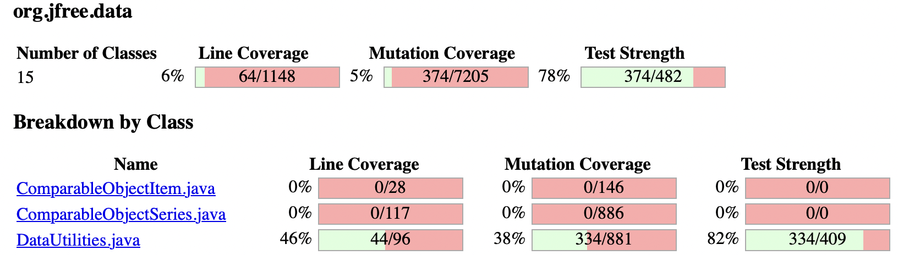

**SENG 438 - Software Testing, Reliability, and Quality**

**Lab. Report \#4 – Mutation Testing and Web app testing**

| Group \#: 18     |     
| -------------- |
| Student Names: |     
|Abdul Rafay        |    
|Mohammed Azmath Khan|
|Taiwu Chen           |     
|Hashir Naved         |  

# Introduction
In this lab, we are going to practice with mutation testing and GUI testing. In part 1 of the lab, we will try to perform mutation testing based on the test files we previously wrote in lab 2 and lab 3 for Range.java and DataUtilites.java files. A testing tool Pitest is used to provide automated generation of mutants, and run our tests against mutants. The initial mutation score based on our lab 3 submission files will be first tested and recorded. Our goal is to increase this old mutation score by at least 10% by adding more testing cases. We will also choose 10 mutants from the Pitest report and analyze why they are killed or not. This analysis is important for us to write new mutation tests.

In part 2, we are going to perform GUI testing with Sport chek’s web page. The Selenium IDE web-interface testing tool is used for automating our test cases. We need to decide the sequence of events on the web interface we want to test for GUI tests. The test events our group chose to test are search, sign in, register, change store, apply promotion code, filter, check out, and sort function. We will test each functionally with different possible data to ensure a comprehensive testing. After recording our test cases, we will execute the recorded scripts to test the system. Finally, we will report any defects we found with this test automation.

# Analysis of 10 Mutants of the Range class 
| **Mutant**                          | **Line** | **Description**                              | **Killed?** | **Reason**                                                                 |
|-------------------------------------|----------|----------------------------------------------|-------------|---------------------------------------------------------------------------|
| 1. Removed conditional              | 90       | Replaced `b0 <= b1` with `false`             | No          | No test for `b0 > b1` case in `intersects()`.                            |
| 2. Decremented double local var 1   | 90       | Decremented `b0` in `b0 <= b1`               | No          | No test where decrementing `b0` changes the condition outcome.            |
| 3. Incremented double local var 1   | 90       | Incremented `b0` in `b0 <= b1`               | No          | No test where incrementing `b0` changes the condition outcome.            |
| 4. Less or equal to greater or equal| 90       | Replaced `b0 <= b1` with `b0 >= b1`          | No          | No test for `b0 > b1` case in `intersects()`.                            |
| 5. Decremented double field lower   | 105      | Decremented `this.lower` in `value < lower`  | Yes         | Killed by `testConstrain_BelowLowerBound_AcceptsBug`.                     |
| 6. Decremented double field lower   | 123      | Decremented `this.lower` in `return lower`   | Yes         | Killed by `testConstrain_BelowLowerBound_AcceptsBug`.                     |
| 7. Incremented double field lower   | 123      | Incremented `this.lower` in `return lower`   | Yes         | Killed by `testConstrain_BelowLowerBound_AcceptsBug`.                     |
| 8. Decremented double field upper   | 132      | Decremented `this.upper` in `return upper`   | Yes         | Killed by `testConstrain_AboveUpperBound`.                                |
| 9. Incremented double field upper   | 132      | Incremented `this.upper` in `return upper`   | Yes         | Killed by `testConstrain_AboveUpperBound`.                                |
| 10. Substituted 1 with -1           | 144      | Substituted `1` with `-1` in some method     | No          | Likely in an untested method like `scale()` or `expand()`.                |

# Report all the statistics and the mutation score for each test class
## (1) Range Class

Figure 1- Range Pit Test Coverage Report for old test suite

Figure 2- Range Pit Mutations for old test suite

Figure 3- Range Pit Test Coverage Report for new test suite

Figure 4- Range Pit Mutations for new test suite

Figure 5- DataUtilities Pit Test Coverage Report for old test suite

Figure 6- DataUtilities Pit Mutations for old test suite

Figure 7- DataUtilities Pit Test Coverage Report for new test suite

Figure 8- DataUtilities Pit Mutations for new test suite

# Analysis drawn on the effectiveness of each of the test classes

# A discussion on the effect of equivalent mutants on mutation score accuracy

# A discussion of what could have been done to improve the mutation score of the test suites

# Why do we need mutation testing? Advantages and disadvantages of mutation testing

# Explain your SELENUIM test case design process

# Explain the use of assertions and checkpoints

# how did you test each functionaity with different test data

# Discuss advantages and disadvantages of Selenium vs. Sikulix

# How the team work/effort was divided and managed

# Difficulties encountered, challenges overcome, and lessons learned
The assignment proved to be moderately difficult while requiring us to overcome different obstacles while working on it. Our main challenge as it was in previous labs was to run Eclipse projects effectively among different configurations while setting up PITest installation. The team experienced PITest functionality problems that required installing the most current version directly through the website since the built-in marketplace of Eclipse did not resolve the issue. The manually performed equivalent mutant search was lab intensive and the PIT report generation took long. Our success in this project depended heavily on the previous laboratory experiences and lecture materials about mutation testing. Effective collaboration between team members became possible thanks to early workload commencement which resulted in successful completion.

# Comments/feedback on the lab itself
This lab was very interesting, and was helpful for learning mutations and GUI testing. However, our group had a hard time getting our environmnet set up for the mutation testing. It would have been useful to have very explicitly stated instructions for setting up external libaries and file structure. This would have helped us to get our testing done sooner.
