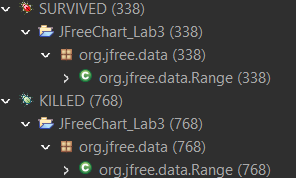

**SENG 438 - Software Testing, Reliability, and Quality**

**Lab. Report \#4 – Mutation Testing and Web app testing**

| Group \#: 18     |     
| -------------- |
| Student Names: |     
|Abdul Rafay        |    
|Mohammed Azmath Khan|
|Taiwu Chen           |     
|Hashir Naved         |  

# Introduction
In this lab, we are going to practice with mutation testing and GUI testing. In part 1 of the lab, we will try to perform mutation testing based on the test files we previously wrote in lab 2 and lab 3 for Range.java and DataUtilites.java files. A testing tool Pitest is used to provide automated generation of mutants, and run our tests against mutants. The initial mutation score based on our lab 3 submission files will be first tested and recorded. Our goal is to increase this old mutation score by at least 10% by adding more testing cases. We will also choose 10 mutants from the Pitest report and analyze why they are killed or not. This analysis is important for us to write new mutation tests.

In part 2, we are going to perform GUI testing with Sport chek’s web page. The Selenium IDE web-interface testing tool is used for automating our test cases. We need to decide the sequence of events on the web interface we want to test for GUI tests. The test events our group chose to test are search, sign in, register, change store, apply promotion code, filter, check out, and sort function. We will test each functionally with different possible data to ensure a comprehensive testing. After recording our test cases, we will execute the recorded scripts to test the system. Finally, we will report any defects we found with this test automation.

# Analysis of 10 Mutants of the Range class 
| **Mutant**                          | **Line** | **Description**                              | **Killed?** | **Reason**                                                                 |
|-------------------------------------|----------|----------------------------------------------|-------------|---------------------------------------------------------------------------|
| 1. Removed conditional              | 161       | Replaced `b0 < this.upper && b1 >= b0` with `true`             | No          | No test for `b0 > this.upper OR b1 < b0` case in `intersects()`.                            |
| 2. Decremented double field lower   | 132       | Decremented `this.lower` in `this.lower / 2.0 + this.upper / 2.0`               | No          | No test where decrementing `lower` changes the condition outcome.            |
| 3. Decremented double field upper   | 132       | Decremented `this.upper` in `this.lower / 2.0 + this.upper / 2.0`               | No          | No test where incrementing `this.upper` changes the condition outcome.            |
| 4. Less or equal to | 158       | Replaced `b1 > this.lower` with `b1 <= this.lower`          | No          | No test for `b1 < this.lower` case in `intersects()`.                            |
| 5. Decremented double field lower   | 105      | Decremented `this.lower` in `return this.lower`  | Yes         | Killed by `testNegativeRangeGetLower`.                     |
| 6. Decremented double field lower   | 123      | Decremented `this.lower` in `return this.upper - this.lower`   | Yes         | Killed by `testGetLengthPositivePositive`.                     |
| 7. Incremented double field lower   | 123      | Incremented `this.lower` in `return this.upper - this.lower`   | Yes         | Killed by `testGetLengthNegativePositive`.                     |
| 8. Decremented double field upper   | 132      | Decremented `this.upper` in `return this.lower / 2.0 + this.upper / 2.0`   | Yes         | Killed by `centralValueShouldBeNegative`.                                |
| 9. Incremented double field upper   | 132      | Incremented `this.upper` in `return this.lower / 2.0 + this.upper / 2.0`   | Yes         | Killed by `centralValueShouldBeZero`.                                |
| 10. Removed conditional           | 144      | Replaced `value >= this.lower && value <= this.upper` with `false`      | Yes          |  Killed by `rangeDoesntContainAboveUpperBound`.                |

# Report all the statistics and the mutation score for each test class
## (1) Range Class
  
Figure 1 - Range PIT Test Coverage Report for old test suite  

  
Figure 2 - Range PIT Mutations for old test suite  

  
Figure 3 - Range PIT Test Coverage Report for new test suite  

  
Figure 4 - Range PIT Mutations for new test suite  

## (2) DataUtilities Class
  
Figure 5 - DataUtilities PIT Test Coverage Report for old test suite  

  
Figure 6 - DataUtilities PIT Mutations for old test suite  

  
Figure 7 - DataUtilities PIT Test Coverage Report for new test suite  

  
Figure 8 - DataUtilities PIT Mutations for new test suite    

# Analysis drawn on the effectiveness of each of the test classes

# A discussion on the effect of equivalent mutants on mutation score accuracy
Based on definition, equivalent mutants are the mutants that do the exactly same thing with the original program. They act in the same behavior as the original program. For example, if the original source code is “a = a+1” and if there is a mutant changes the code to be “a++”, then it will be an equivalent mutant since it does the same thing compared with the original code.

Equivalent mutants will have no influence on mutation score. Since mutation score is calculated by mutation score = number of mutants killed by the test suites / number of all non equivalent mutants. Although equivalent mutants will always survive, it is not included within both denominator and numerator, so that equivalent mutants will have no impact on mutation score calculation. However, some mutation testing tools such as Pitest do include all mutants when calculating mutation coverage. Since for these tools they are not able to identify if a mutant is an equivalent mutant or not, in this way, it will decrease mutation score accuracy.

# A discussion of what could have been done to improve the mutation score of the test suites
Since the mutation score is calculated by the number of mutants killed by the test suites / number of all non equivalent mutants, to increase the mutation score, we need to have more non equivalent mutants to be detected and killed. In order to achieve that, we need to create more test cases based on the following conditions. First a test must reach the mutated statement. Otherwise if a mutated statement is not even reached, it can have no influence on the output, therefore that mutant can never be detected and killed. This condition is easy to reach if we have a good line coverage rate of our tests. Second, test input data should infect the program state by causing different program states for the mutant and the original program. This means we can try to create test cases based on the different kinds of mutants. For example, if we have a mutant which changes the condition within a if statement from a equality condition check to always false, then we must have a test case to make the condition of that if statement becomes true, and the execution code within that if statement must have some influences on output, such that that mutants can be detected. Finally, The incorrect program state must propagate to the program's output and be checked by the test. This is to say, our test cases must be able to catch and detect the incorrect program state caused by mutants. Otherwise, if a mutant changes the program state but test cases don’t check for that state, that mutant still can not be detected.

# Why do we need mutation testing? Advantages and disadvantages of mutation testing
Mutation testing can facilitate the design or the evaluation of the quality of a test
suite. Compared to simple coverage metrics such as line coverage which only
guarantees the execution of the code segment (reachability), mutation coverage
actually adds a stressor that challenges a test suite (i.e. a bug) and ensures a statement
is reached and checks the state of the execution. It creates unit copies of the SUT with
a single change which is called a mutation, and then the test suite is run against the
new code to assess if the bug injection is captured by the test suite.

| **Advantages**                                                                                   | **Disadvantages**                                                                                     |
|--------------------------------------------------------------------------------------------------|-------------------------------------------------------------------------------------------------------|
| **Automated with Frameworks**: Can be automated using tools like PIT, streamlining the process. | **Computationally Intensive**: Generates many mutants, requiring careful selection of operators to manage the load. |
| **Systematic Approach**: Provides a structured method to evaluate test suites.                  | **Equivalent Mutants**: These skew the mutation score and require time-consuming manual identification. |
| **Tangible Goal**: Offers a clear metric (mutation score) to guide testing efforts.             | **Time-Consuming and Costly**: Generating and testing mutants is slow and often requires automation tools. |
| **Improves Test Suite Quality**: Forces robust test case creation, enhancing fault detection.   | **Not Suitable for Black Box Testing**: Requires source code changes, making it incompatible with black box testing. |
| **Increases Reliability**: Ensures bugs altering program behavior are caught, improving quality. | **Complex Analysis**: Analyzing surviving mutants and designing new tests can be complex and time-intensive. |
# Explain your SELENUIM test case design process

## a. Identify Functionalities

First, we explored the **Gap Canada website** to find key user flows. We selected two major functionalities:

- **User Account Management** (e.g., Login)
- **Shopping Process** (e.g., Search, Add to Cart)

---

## b. Define Specific Test Scenarios

Within these functionalities, we broke down test scenarios to cover both positive and negative flows, as well as various data inputs.

---

## c. Outline Test Steps and Expected Results

For each scenario, we created step-by-step instructions describing how to navigate the site, what inputs to provide, and the expected outcome, such as:

- **Positive Scenario**:  
  - *Expected Result*: "Login succeeds and displays a welcome message."
  
- **Negative Scenario**:  
  - *Expected Result*: "An error message appears for invalid credentials."

---

## d. Record and Fine-Tune in Selenium IDE

We recorded the steps using **Selenium IDE** and performed the following tasks:

1. Added necessary waits or adjusted locators (CSS/XPath) to ensure that each step interacts with the correct element.
2. Included verification commands (assertions) to confirm that the actual results match the expected results.

---

## e. Example of 8 Test Cases

### **Login Functionality**
| Test Case ID | Test Scenario                         | Expected Outcome                                 |
|-------------|---------------------------------------|--------------------------------------------------|
| TC1         | Valid Login                            | Login succeeds and displays a welcome message     |
| TC2         | Invalid Login (wrong password)          | Error message appears indicating invalid password |
| TC3         | Invalid Login (unregistered email)      | Error message appears indicating invalid email    |
| TC4         | Logout                  | Successfully logs out and redirects to home page  |

### **Shopping Functionality**
| Test Case ID | Test Scenario                         | Expected Outcome                                 |
|-------------|---------------------------------------|--------------------------------------------------|
| TC5         | Search for an Existing Product          | Displays product search results                   |
| TC6         | Search for a Non-Existing Product       | Displays "No results found" message                |
| TC7         | Add Product to Cart                     | Product added successfully with confirmation       |
| TC8         | Remove Product from Cart                 | Product removed from cart with confirmation        |

---

# Explain the use of assertions and checkpoints

## a. Purpose of Assertions

Assertions verify whether the application is functioning as expected after each significant action. They ensure that:

- The application behaves as intended.
- Expected outcomes match actual outcomes.
- Any discrepancies are immediately detected.

**Example:**  
After clicking the **“Login”** button, we use an assertion to check if the page displays a **“Welcome”** message or the user’s account dashboard.

---

## b. Types of Assertions in Selenium IDE

Selenium IDE provides various assertion commands to verify different aspects of the application. The most commonly used ones are:

- **assertText:**  
  Checks if specific text appears on the page.  
  *Example:* Verifying the message **“Login successful”** after signing in.

- **assertElementPresent:**  
  Verifies whether a certain element (e.g., a **“Sign Out”** link) is present in the DOM.  
  *Example:* Checking the presence of the **“Logout”** button after a successful login.

- **verifyTitle:**  
  Confirms that the page title matches the expected title.  
  *Example:* Ensuring that the title changes to **“My Account”** after logging in.

---

## c. Strategic Checkpoints

To ensure robustness, we place assertions strategically throughout the test scripts:

### Before Key Actions:
- **Purpose:** To confirm that critical elements are loaded and ready.  
- *Example:* Check that the **search bar** is present before entering any query.

### After Key Actions:
- **Purpose:** To verify that the result or outcome of the action matches expectations.  
- *Example:* Confirm that a **“Product added to cart”** notification appears after adding an item.

---

## d. Example of Assertion Usage

### **TC1: Valid Login**
- **Step:** Submit valid credentials.
- **Assertion:**  
  - Use **assertText** to check for the message **"Welcome, [User Name]"**.  
  - Validate that the **user dashboard** is displayed.

### **TC5: Search for an Existing Product**
- **Step:** Type a product name in the search bar and submit.  
- **Assertion:**  
  - Use **assertElementPresent** to ensure that **search results** are displayed.  
  - Optionally, use **assertText** to verify the presence of the product name in the results list.

# how did you test each functionaity with different test data

| **Test Case**                           | **Test Data**                                                                                                                                      | **Expected Outcome**                                                              |
|-----------------------------------------|----------------------------------------------------------------------------------------------------------------------------------------------------|-----------------------------------------------------------------------------------|
| **1. Valid Login**                      | Email: evanchaaan@gmail.com Password: $K^&NBj0jXtP                                                                                                | Successful login; welcome message (e.g., "Welcome, validuser") is displayed         |
| **2. Invalid Login (Wrong Password)**   | Email: evanchaaan@gmail.com Password: WrongPass                                                                                                | Error message: "Your password is incorrect" is displayed                           |
| **3. Invalid Login (Unregistered Email)** | Email: none@test.com Password: AnyPassword                                                                                               | Error message: "Email not recognized" (or similar) is displayed                    |
| **4. Logout**                           | Start with a valid logged-in session, then click on the Logout/Sign Out link                                                                      | Returns to guest state; Sign In link is visible                                  |
| **5. Search for Existing Product**      | Search term: "Jersey Crewneck T-Shirt"                                                                                                                    | Search results display relevant products                                          |
| **6. Search for Non-Existing Product**  | Search term: "XYZ123"                                                                                                                                | "No results found" message is displayed                                          |
| **7. Add Product to Cart**              | After searching for a product (e.g., "Jeans"), select a product and choose options (size, color) if required, then click "Add to Cart"            | The product is added to the cart; cart badge or confirmation is updated             |
| **8. Remove Product from Cart**         | With a product already in the cart, click the "Remove" or "Delete" option for the product                                                           | The product is removed; cart updates to show zero items or "Your cart is empty"     |

# Discuss advantages and disadvantages of Selenium vs. Sikulix

| **Tool**   | **Advantages**                                                                                                        | **Disadvantages**                                                                                                                              |
|-----------|------------------------------------------------------------------------------------------------------------------------|------------------------------------------------------------------------------------------------------------------------------------------------|
| Selenium  | - Specialized for web applications, allowing direct interaction with HTML elements (DOM).                                | - Limited to browser-based testing (not ideal for desktop apps).                                                                                 |
|           | - Easy record-and-playback for quick test script creation.                                                               | - Dynamic web elements may require frequent locator updates.                                                                                     |
|           | - Built-in assertions for validation.                                                                                    | - No direct visual testing (relies on DOM locators rather than image matching).                                                                   |
| Sikulix   | - Uses image recognition, enabling automation of any on-screen elements (including desktop apps).                        | - Highly sensitive to UI changes (small design alterations can break tests).                                                                     |
|           | - Cross-platform support (Windows, macOS, Linux).                                                                        | - Slower and more resource-intensive due to image processing.                                                                                   |
|           | - Simple scripting if you’re comfortable with visual matching.                                                           | - Lacks built-in web-specific features (treats browser as just another window).                                                                  |

---

# Difficulties encountered, challenges overcome, and lessons learned
The assignment proved to be moderately difficult while requiring us to overcome different obstacles while working on it. Our main challenge as it was in previous labs was to run Eclipse projects effectively among different configurations while setting up PITest installation. The team experienced PITest functionality problems that required installing the most current version directly through the website since the built-in marketplace of Eclipse did not resolve the issue. The manually performed equivalent mutant search was lab intensive and the PIT report generation took long. Our success in this project depended heavily on the previous laboratory experiences and lecture materials about mutation testing. Effective collaboration between team members became possible thanks to early workload commencement which resulted in successful completion.

# Comments/feedback on the lab itself
This lab was very interesting, and was helpful for learning mutations and GUI testing. However, our group had a hard time getting our environmnet set up for the mutation testing. It would have been useful to have very explicitly stated instructions for setting up external libaries and file structure. This would have helped us to get our testing done sooner.
